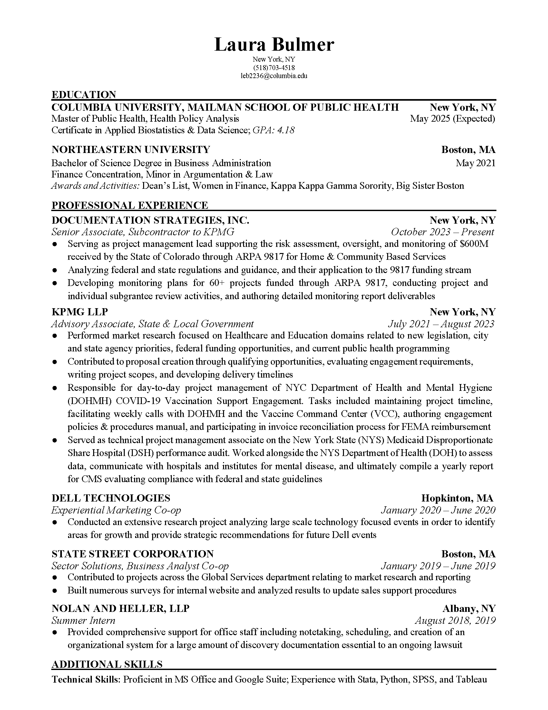

My background is in state and local government consulting, and I am currently pursuing a Master of Public Health degree at Columbia University’s Mailman School of Public Health, where I focus on Health Policy & Management and am working toward a certificate in Applied Biostatistics.

Post graduation, I am interested in working within the field of Health Policy consulting. For more detailed information regarding my academic and professional details, please refer to the resume below. 

While you're here, add me on [LinkedIn](https://www.linkedin.com/in/laura-bulmer-935ab4171)! 

    

